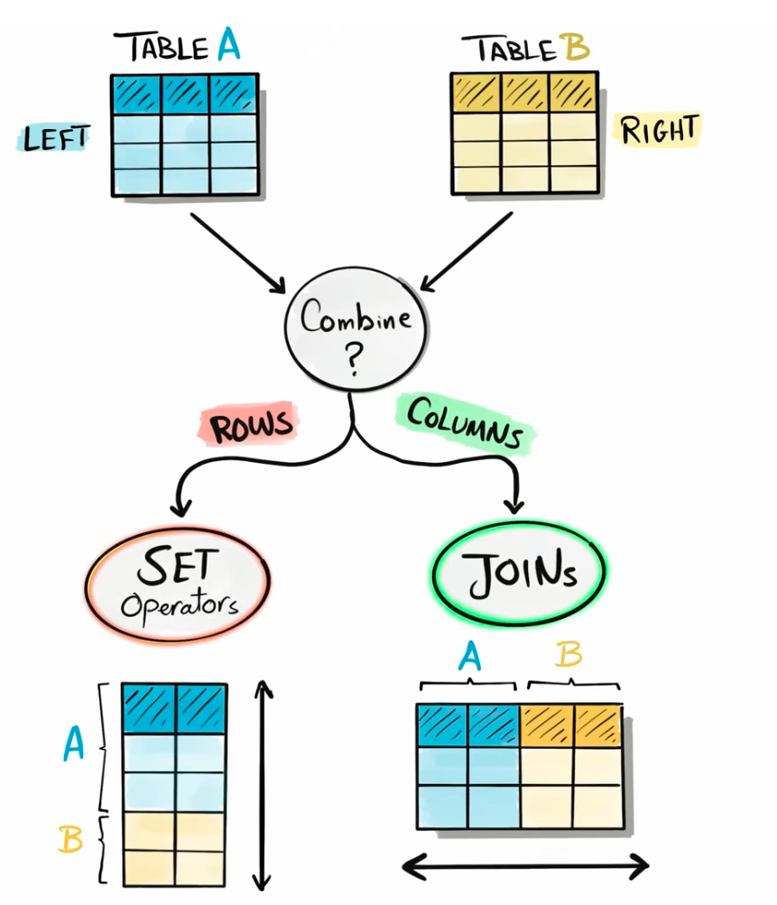
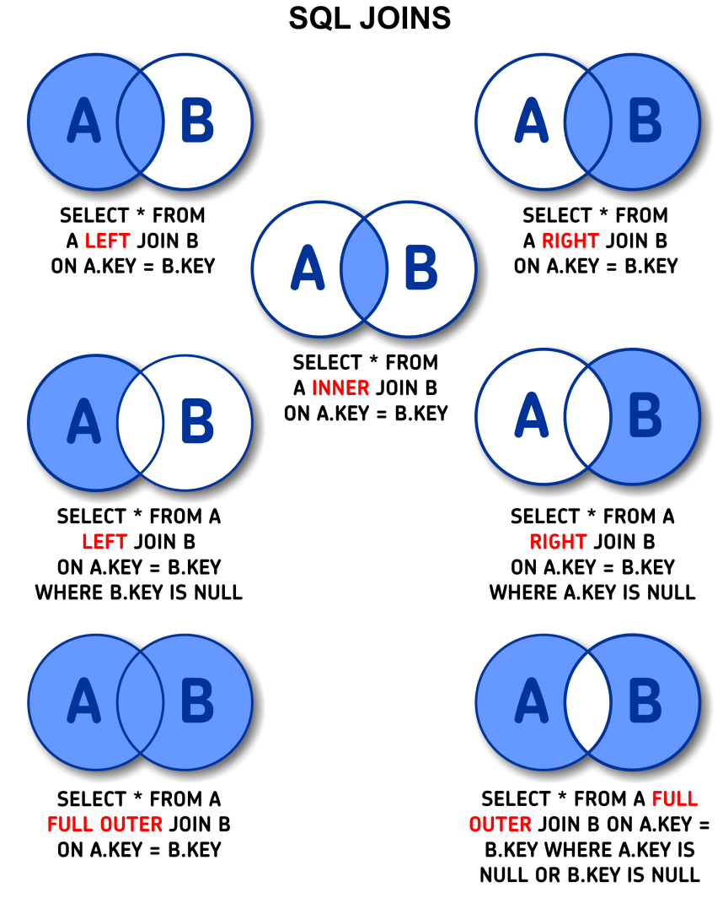
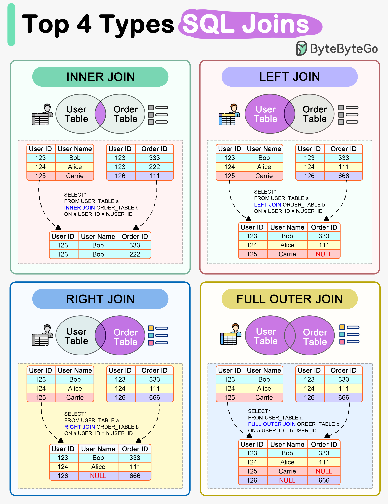
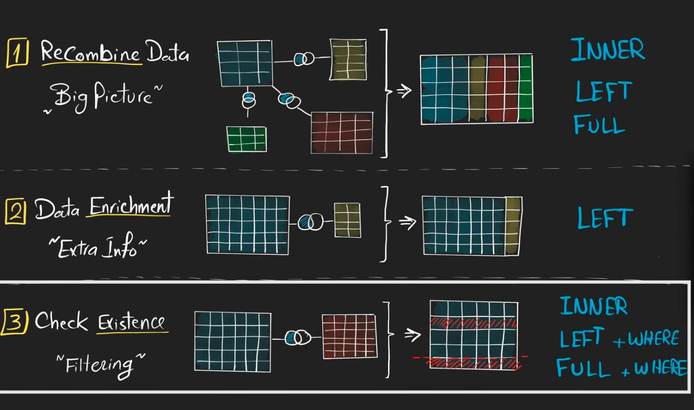
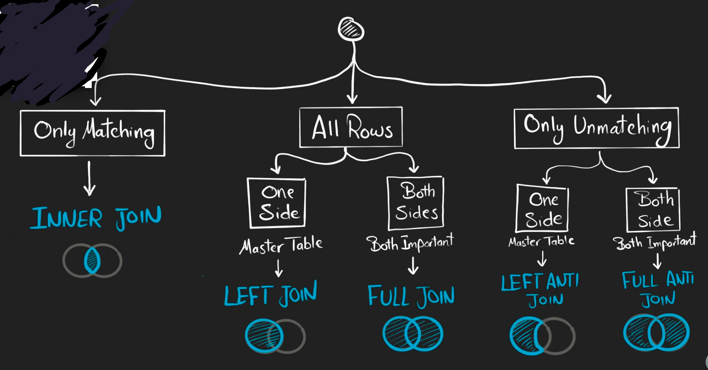

# SQL JOINS

SQL combinations:

* Columns --> Joins
* Rows -- > Set operators







## Top 4 Types of SQL Joins




## LEFT JOIN

Returns all records from the left table, and the matched records from the right table.

It returns NULL for all non-matching records from the right table.

```sql
SELECT column_name(s)
FROM table1
LEFT JOIN table2
ON table1.column_name = table2.column_name;
```


## RIGHT JOIN

Returns all records from the right table, and the matched records from the left table.

The RIGHT JOIN returns NULL for all non-matching records from the left table. In some databases, it is called RIGHT OUTER JOIN.

```sql
SELECT column_name(s)
FROM table1
RIGHT JOIN table2
ON table1.column_name = table2.column_name;
```


## **FULL JOIN**

Returns all records when there is a match in either left or right table. It includes NULL for any non-matching records.

```SQL
SELECT column_name(s)
FROM table1
FULL OUTER JOIN table2
ON table1.column_name = table2.column_name;
```

**Note:** `FULL OUTER JOIN` can potentially return very large result-sets!


## **SELF JOIN**

```SQL
SELECT column_name(s)
FROM table1 T1, table1 T2
WHERE condition;
```


# Reasons to JOIN data

* Recombine data
* Data enrichment
* Check the existence of data in table




# Join decision tree




### References

* https://www.sqlshack.com/sql-multiple-joins-for-beginners-with-examples/
* https://github.com/ByteByteGoHq/system-design-101/blob/main/data/guides/how-do-sql-joins-work.md
* Data with Baara - [SQL Full Course for Beginners (30 Hours) – From Zero to Hero](https://www.youtube.com/watch?v=SSKVgrwhzus&list=PLNcg_FV9n7qZY_2eAtUzEUulNjTJREhQe)
