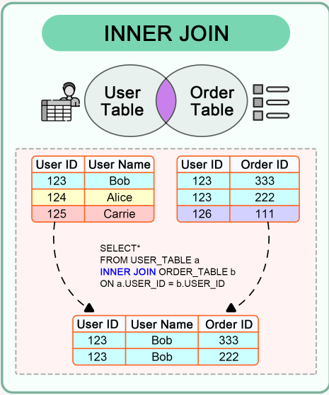
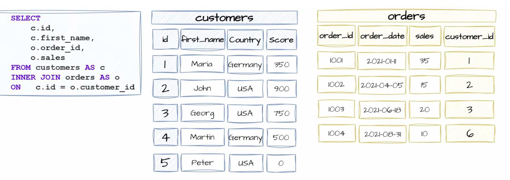
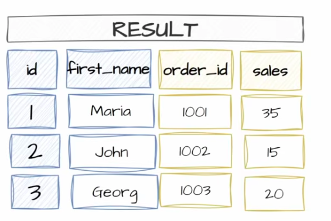

## INNER JOIN

Returns records that have matching values in two or more tables.

```sql
SELECT table1.column_name(s), table2.column_name(s)
FROM table1
INNER JOIN table2
ON table1.column_name = table2.column_name;
```

The order of tables doesn't matter


# Reasons to JOIN data

* Recombine data
* Data enrichment
* Check the existence of data in table


# Examples

## Example 1





## Example 2






