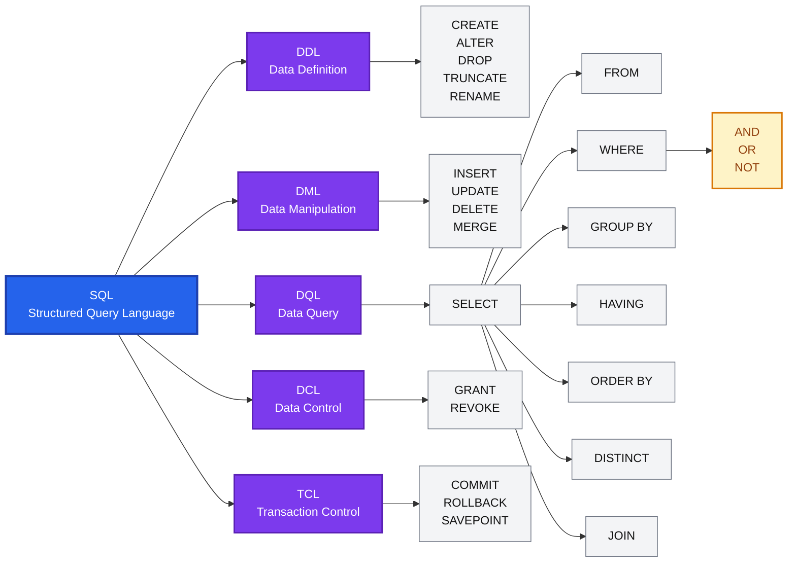

# SQL
Structured Query Language (SQL) is a standard language for storing, manipulating and retrieving data in databases.
## Content

* [1. SQL Fundamentals](01_sql-fundamentals/)
* [2. SQL Database](02_sql-database/)
* [3. SQL Data Manipulation](03_sql-data-manipulation/)
* [4. SQL Data Query](04_sql-data-query/)
* [5. SQL Operators](05_sql-operators/)
* [6. SQL Joins](06_sql-joins/)
* [7. SQL Combinations](07_sql-combinations/)
* [SQL Functions](https://github.com/rosa-lpz/SQL/blob/main/SQL%20Functions.md)

# Resources

## Cheatsheets
 * DataQuest - SQL Cheat Sheet | [PDF](cheatsheets/dataquest_sql-cheat-sheet.pdf)  | [Website](https://www.dataquest.io/cheat-sheet/sql-cheat-sheet/) 

## Courses

* Data with Baara - SQL Full Course for Beginners (30 Hours) – From Zero to Hero: https://youtu.be/SSKVgrwhzus

