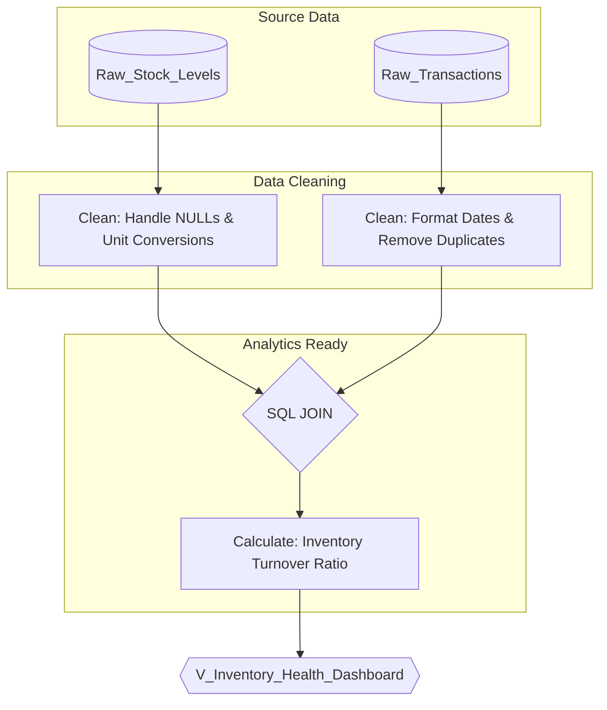

```mermaid
graph TD
    %% Layer 1: Bronze (Raw)
    subgraph Bronze_Layer [Source Data]
        RAW_STK[(Raw_Stock_Levels)]
        RAW_TRX[(Raw_Transactions)]
    end

    %% Layer 2: Silver (Cleaning)
    subgraph Silver_Layer [Data Cleaning]
        CLN_STK[Clean: Handle NULLs & Unit Conversions]
        CLN_TRX[Clean: Format Dates & Remove Duplicates]
    end

    %% Layer 3: Gold (Business Logic)
    subgraph Gold_Layer [Analytics Ready]
        JOIN_DATA{SQL JOIN}
        CALC_METRICS[Calculate: Inventory Turnover Ratio]
    end

    %% Final Output
    FINAL_VIEW{{V_Inventory_Health_Dashboard}}

    %% Relationships
    RAW_STK --> CLN_STK
    RAW_TRX --> CLN_TRX
    CLN_STK --> JOIN_DATA
    CLN_TRX --> JOIN_DATA
    JOIN_DATA --> CALC_METRICS
    CALC_METRICS --> FINAL_VIEW
```